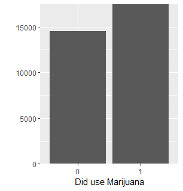
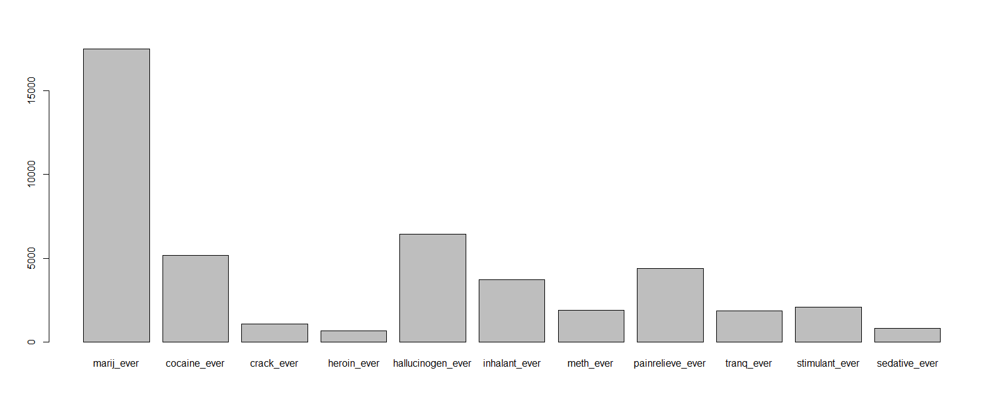
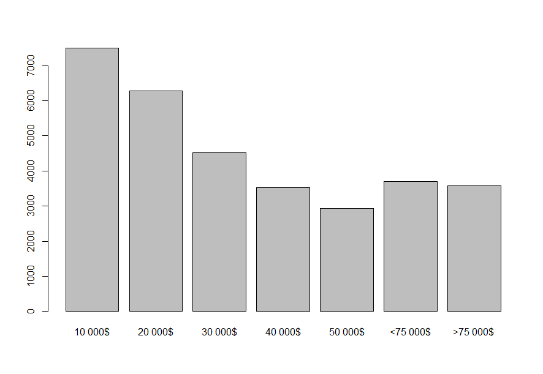
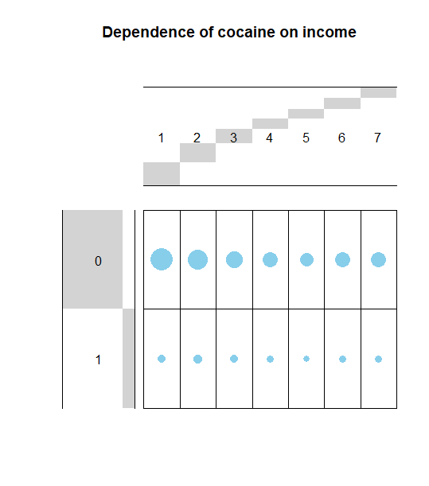
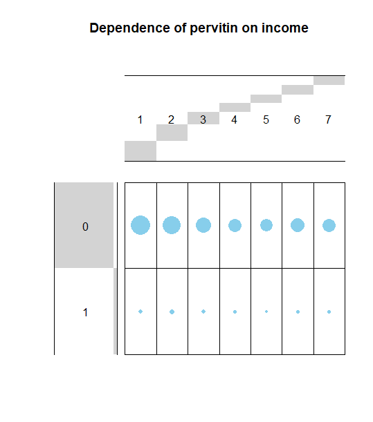
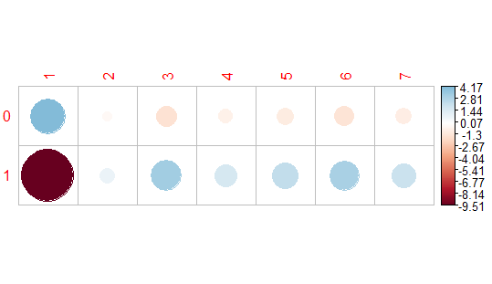
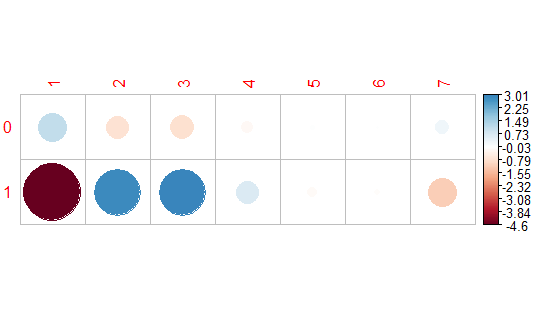

# Zápočtový projekt
## Pravděpodobnost a Statistika 1
### Martin Gráf 2022

---
---

# Zkoumání užívání drog naskrz regiony a rasami
***Použitá data:***  https://data.world/balexturner/drug-use-employment-work-absence-income-race-education/workspace/project-summary?agentid=balexturner&datasetid=drug-use-employment-work-absence-income-race-education

---

## Na rozehřátí
### Náš dataset

Data byla pořízena dotazováním civilistů starších 12-ti let na území USA z různorodých ekonomických skupin. Průzkumu se účastnili lidé z ubytoven pro bezdomovce, vysokoškolských kolejí, soukromých rezidencí, vojenských innstalací, a skupinových bytů.

Data byla shromážděna a zpracována **Výzkumným institutem Triangle**, **Výzkumným parkem Triangle** v Severní Karolíně.

Podrobný postup a metody použité při shromažďování dat jsou popsané zde: https://data.world/balexturner/drug-use-employment-work-absence-income-race-education/workspace/file?filename=NSDUH-2015-info-description.pdf

Pro naše účely jsou to ovšem nadbytečné informace.

Podrobný popis jednotlivých dotazovaných proměnných zde: https://data.world/balexturner/drug-use-employment-work-absence-income-race-education/workspace/file?filename=NSDUH-2015-DS0001-info-codebook.pdf

Stručně si popišme náš dataset:

- QUESTID2
   - Identifikace respondenta
   - Funkčně identické s id
- Drogy
   - Každá z následujících drog obsahuje informace:
      - ever -  Zdali respondent drogu někdy užil

         0. Ne
         1. Ano
      - month - Užití v posledním měsíci

         0. Ne
         1. Ano
      - year - Užití během posledního roku

         0. Ne
         1. Ano

   - Tyto informace máme o:
      - Marihuana
      - Kokain
      - Crack
      - Heroin
      - Hallucinogeny
      - Inhalanty
      - Pervitin
      - Medikace proti bolesti
      - Sedativa na předpis
      - Stimulanty
      - Sedativa
      - Jakákoliv droga
      - Jakákoliv droga s vyjímkou marihuany
   - Užití Farmaceutik za poslední měsíc
   - Užití zakázaných drog za poslední měsíc
   - Užití zakázaných drog za poslední měsíc s vyjímkou marihuany - "nomj" sloupce
   - Počet užití jakýchkoliv drog za poslední měsíc / rok / kdykoliv
   - Seznam použitých drog
- Socioekonomický status (_Drogové testy mohou být zaměřovány na příslušníky určitých skupin více než na příslušníky jiných_)
   - Osobní příjem
     - Od 1. do 7. 
     - S rostoucí cifrou roste příjem v intervalech přibližně 10 000$ ročně
   - Rodinný příjem
   - Status zaměstnání
      1. Plný úvazek
      2. Částečný úvazek
      3. Nezaměstnaný
   - Drogový test před nástupem do zaměstnání
   - Náhodný drogový test
   - Rasa
   - Vzdělání - (Pro zjednodušení hrubě přeložíme vzdělávací kategorie používané v USA na hierarchii vzdělání v ČR)
      1. Základní škola
      2. Střední škola
      3. Vysoká škola
      4. Vysokoškolský titul (Bakalář a vyšší)
      5. Nezletilý - zatím ve vzdělávacím systému
   - Pracoval by pro zaměstnavatele, který používá drogové testy
      1. Spíše ano
      2. Spíše ne
      3. Nezáleží na tom
   - Pohlaví
   - Využil nemocenské dovolené
   - Využil dovolené

---

## Trocha pravděpodobností

Na rozehřátí se podívejme, zdali je marihuana opravdu vstupní drogou pro drogy ostatní.

Konkrétně máme 32040 respondentů, z nichž 17483 marihuanu v minulosti užilo a 14557 nikoliv. To máme celkem 45.43383% pravděpodobnost že respondent nikdy marihuanu neužil a 54.56617% že ano.
Naproti tomu máme 11253 lidí, kteří použili i jinou drogu než marihuanu a 20787, kteří nikoliv. To znamená, že 35.12172% ano a 64.87828% ne.

 - **P(MU = uživatel marihuany)** = 0.5456617
 - **P(MN = neuživatel marihuany)** = 0.4543383
 - **P(DU = uživatel drog mimo marihuanu)** = 0.3512172
 - **P(DN = neuživatel drog mimo marihuanu)** = 0.6487828

_mimo marihuanu říká, že respondent při odpovědi nebral v potaz užívání nebo neužívání marihuany, nikoliv že respondent použil drogy ale ne marihuanu_

 - **P(MU ∩ DU)** = 0.3060237
 - **P(MU ∩ DN)** = 0.239638
 - **P(MN ∩ DU)** = 0.04519351
 - **P(MN ∩ DN)** = 0.4091448

K těmto výsledkům jsme se dostali pomocí:

      drug_users <- drug_use[drug_use$anydrugever_nomj == TRUE,]
      drug_non_users <- drug_use[drug_use$anydrugever_nomj == FALSE,]

      drug_marij_users <- drug_users[drug_users$marij_ever == TRUE,]
      drug_marij_non_users <- drug_users[drug_users$marij_ever == FALSE,]

      non_drug_marij_users <- drug_non_users[drug_non_users$marij_ever == TRUE,]
      non_drug_marij_non_users <- drug_non_users[drug_non_users$marij_ever == FALSE,]

V tuto chvíli jsou podmíněné pravděpodpobnosti pouze formalitou: P(A|B) = P(A ∩ B)/P(B) a P(B|A) = (P(A|B)*P(B))/P(A)

 - **P(DU | MU)** = 0.3060237 / 0.5456617 = 0.56083045594
 - **P(MU | DU)** = (0.56083045594*0.5456617)/0.3512172 = 0.87132321537

Tedy více jak každá druhá osoba, o které víme, že užívá marihuanu má zkušenosti s ostatními drogami. Budeme ovšem mít VELKÉ štěstí, pokud potkáme uživatele drog, který nikdy neužil marihuanu. Stereotyp se nám tak jistě nepodařilo vyvrátit, ale dokonce potvrdit. Šance že respondent užil drogy je sama o sobě nižší, než pokud vycházíme z předpokladu, že užívá marihuanu. O vztahu v druhém směru němluvě.

---

## Superschopnosti?

Ne, toto není pokus nalézt dopad užívání drog na osobní příjem. K takovému zkoumání nemáme dostatek informací. Můžeme ovšem zjistit, které příjmové skupiny mají tendenci k užívání kterých drog.

Pojďme si nejprve nalézt popularitu jednotlivých drog a příjmovou distribuci respondentů:

Nejprve provedeme něco formátování pro snažší plotting:

      column <- c(nrow(drug_use[drug_use$marij_ever == TRUE,]),
         nrow(drug_use[drug_use$cocaine_ever == TRUE,]),
         nrow(drug_use[drug_use$crack_ever == TRUE,]),
         nrow(drug_use[drug_use$heroin_ever == TRUE,]),
         nrow(drug_use[drug_use$hallucinogen_ever == TRUE,]),
         nrow(drug_use[drug_use$inhalant_ever == TRUE,]),
         nrow(drug_use[drug_use$meth_ever == TRUE,]),
         nrow(drug_use[drug_use$painrelieve_ever == TRUE,]),
         nrow(drug_use[drug_use$tranq_ever == TRUE,]),
         nrow(drug_use[drug_use$stimulant_ever == TRUE,]),
         nrow(drug_use[drug_use$sedative_ever == TRUE,]))

         barplot(column, names=c("marij_ever", "cocaine_ever", "crack_ever", "heroin_ever", "hallucinogen_ever"
         , "inhalant_ever", "meth_ever", "painrelieve_ever", "tranq_ever",
         "stimulant_ever", "sedative_ever"))

Pojďme nyní vyslovit dvě nulové hypotézy:

 - Poměr uživatelů kokainu není závislý na příjmu
 - Poměr uživatelů není závislý na příjmu

Nejprve ke kokainu:

A pro pervitin:

      library(gplots)
      cocaine_table <- table(drug_use$cocaine_ever, drug_use$PersonalIncome)
      balloonplot(t(cocaine_table), main ="Dependence of cocaine on income", xlab ="", ylab="",
                  label = FALSE, show.margins = FALSE)

      pervitin_table <- table(drug_use$meth_ever, drug_use$PersonalIncome)
      balloonplot(t(pervitin_table), main ="Dependence of pervitin on income", xlab ="", ylab="",
                  label = FALSE, show.margins = FALSE)

### V čem vlastně spočívá Chi-squared test?

Nejprve pro každou buňku tabulky spočteme očekávanou hodnotu. Té dosáhneme e = (suma řádku * suma sloupce)/Celkový součet všech hodnot

Statistiku Chi-squared pak získáme X = suma((zpozorovaná hodnota - očekávaná hodnota)**2 / očekávaná hodnota)

Následně spočteme z počtu záznamů "úhly svobody" (Které slouží pouze k použití správné kritické hodnoty pro dataset příslušné velikosti). Můžeme pak zvolit kritickou hodnotu, a p-hodnotu. Kritické hodnoty už jsou naštěstí pro nás předpočítány a p-hodnotu typicky zvolíme 5% nebo méně. Pokud výsledek je platný s pravděpodobností 1-p, typicky se uzná za statisticky významný. Pokud tak naše Chi-hodnota je větší než získaná kritická hodnota, náš výsledek je platný s pravděpodobností >= 1-p.

Tak to pojďme napro... zavolat funkci! 

      > cocaine_chisq

	   Pearson's Chi-squared test

      data:  cocaine_table
      X-squared = 147.93, df = 6, p-value < 0.00000000000000022

      > pervitin_chisq

         Pearson's Chi-squared test

      data:  pervitin_table
      X-squared = 43.01, df = 6, p-value = 0.0000001161

Ihned vidíme, že užití obou drog je závislé na příjmové kategorii, neboť získané p-hodnoty jsou výrazně menší než 0.05. Obě nulové hypotézy tedy odmítneme.

---

## Analýza korelací

To ale bylo moc jednoduché. Prozkoumejme ještě, které příjmové kategorie jsou nejnáchylnější k užívání kokainu a pervitinu. Klasická asociace veřejnosti spojuje užívání kokainu s vyšším příjmem, kdežto užívání pervitinu naopak s chudobou. Jak to tedy ve skutečnosti je?

Očekávané hodnoty:

      > round(cocaine_chisq$expected,2)
         
               1       2       3       4       5       6       7
      0 6285.04 5266.32 3793.16 2949.67 2463.37 3105.63 3000.82
      1 1210.96 1014.68  730.84  568.33  474.63  598.37  578.18

      > round(pervitin_chisq$expected,2)
         
               1       2       3       4       5       6       7
      0 7055.46 5911.86 4258.12 3311.25 2765.33 3486.31 3368.66
      1  440.54  369.14  265.88  206.75  172.67  217.69  210.34

### Pearsonovy reziduály

Ty získáme pouze odmocněním očekávaných hodnot. S jejich pomocí zjistíme které buňky přispívají k závislosti proměnných nejvíce.

      > round(cocaine_chisq$residuals, 3)
   
               1      2      3      4      5      6      7
      0  4.175 -0.349 -1.448 -0.749 -1.035 -1.339 -0.909
      1 -9.511  0.795  3.298  1.706  2.358  3.051  2.072

      > round(pervitin_chisq$residuals, 3)
         
               1      2      3      4      5      6      7
      0  1.149 -0.727 -0.753 -0.178  0.032  0.012  0.282
      1 -4.600  2.908  3.013  0.713 -0.127 -0.046 -1.127

Z toho získáme grafy které už napovídají jak dopadnou naše stereotypy:
Kokain:

Pervitin:

Dále by bylo možné se zaměřit pouze na kladnou/zápornou kontribuci jednotlivých buněk. Pro naše účely je ovšem užitečné vidět jak se tyto hodnoty ovlivňují v obou směrech. 

## Závěr

Nejprve jsme zkoumali jakým způsobem se navzájem ovlivňují pravděpodobnosti užívání nemarihuanovývh drog a marihuany. Nemáme sice detailní chronologická data a tak nedokážeme potvrdit ani vyvrátit, zdali je marihuana skutečně vstupní drogou. Bezpochyby ale platí, že šance užívání ostatních drog je pro uživatele marihuany znatelně, větší, ne ovšem tolik, jako šance užívání marihuany pro uživatele ostatních drog. 

Dále jsme zkoumali, zdali je mezi uživateli pervitinu a kokainu jednoznačná dominující příjmová skupina. Snad trochu překvapivě byla korelace mezi užíváním příslušných drog a nejchudší skupinou záporná. Uživatelů nebylo málo, ale poměr v rámci skupiny byl v obou případech menší, než pro ostatní skupiny. Možná by nás to ale překvapit přeci jen nemělo. Obě z drog jsou přeci jenom známé svojí cenou. Není tedy divu že uživatelé pervitinu jednoznačně vedli v příjmové skupině 10 000$ - 30 000$ a nejbohatší skupina opět začala korelovat negativně. Zdá se ovšem, že kokain spojuje bužoazii v potírání dělnické třídy, neboť kladná korelace je od určité úrovně příjmu poměrně stabilní.